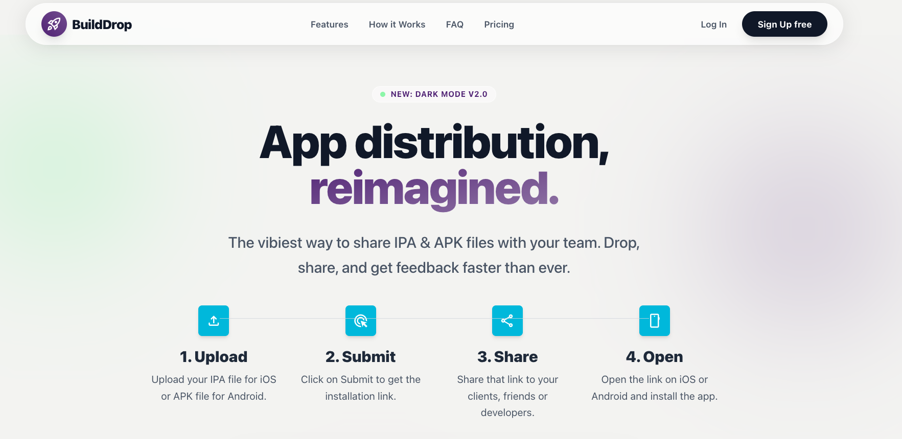

# BuildDrop

Landing page and product UI prototype for **BuildDrop**, an app-distribution experience focused on sharing iOS/Android builds with teams and testers.



## Tech stack

- [Astro 5](https://astro.build/)
- [Tailwind CSS v4](https://tailwindcss.com/) via `@tailwindcss/vite`
- [TypeScript](https://www.typescriptlang.org/)
- [Starwind UI primitives](https://starwind.dev/) (e.g. button component)
- Bun as the package manager/runtime

## Getting started

### 1) Install dependencies

```bash
bun install
```

### 2) Run locally

```bash
bun run dev
```

Astro dev server will run on `http://localhost:4321` by default.

## Available scripts

- `bun run dev` — start local development server
- `bun run build` — create production build in `dist/`
- `bun run preview` — preview production output locally
- `bun run astro -- check src/pages/index.astro` — run Astro checks (you can change the target file)

## Current routes

- `/` → marketing landing page (`src/pages/index.astro`)
- `/dashboard` → dashboard interface mock (`src/pages/dashboard.astro`)
- `/sign-in` → sign-in screen (`src/pages/sign-in.astro`)
- `/sign-up` → sign-up screen (`src/pages/sign-up.astro`)

## Project structure

```text
src/
	components/
		home/                  # Landing page sections (hero, pricing, faq, cta, footer...)
		starwind/button/       # Reusable Starwind button component
	layouts/
		LandingPageLayout.astro
		main.astro
	pages/
		index.astro
		dashboard.astro
		sign-in.astro
		sign-up.astro
	styles/
		global.css             # Tailwind import + brand theme tokens
		starwind.css
docs/
	color-design.md
	screenshot.png
```

## Styling and design notes

- Brand colors are defined in `src/styles/global.css` using Tailwind v4 theme tokens:
  - `--color-brand-primary`
  - `--color-brand-secondary`
  - `--color-brand-complement`
- Home sections are composed from `src/components/home/*` and rendered through `LandingPageLayout.astro`.

## Notes

- This repository currently focuses on frontend screens and interaction patterns.
- Authentication, uploads, analytics, and billing actions shown in the UI are currently static mock behavior.
